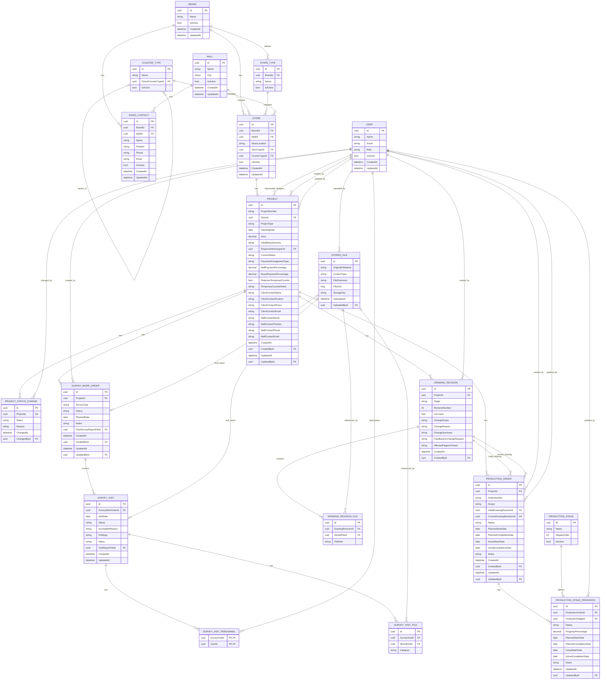

# ProjectNest — Domain & Data Model

## 1. Purpose and Scope

This document defines the domain model and logical data model for the ProjectNest MVP.

ProjectNest is an internal operations management system for retail fit-out projects. It provides a single source of truth for project information, site surveys, drawing revisions, factory orders and production progress.

The model is derived from the real business lifecycle and defines:

* core business entities
* relationships and cardinalities
* business rules
* reference data and enums
* logical tables and fields
* primary and foreign key relationships
* important data integrity constraints

### MVP Domain Scope

```text
Projects
Surveys
Drawings
Production
Identity
Files
```

The following lifecycle areas are outside the current MVP:

```text
Logistics
Site construction
Final acceptance
Mall exit / deposit
Store opening
Warranty
Maintenance
Full procurement management
Client portal
```

---

# 2. Domain Overview

## 2.1 Core Domain Relationships

```text
Brand 1 ───── 0..* Store
Mall  1 ───── 0..* Store

Store 1 ───── 0..* Project

Project
├── 1 ───── 0..* ProjectStatusChange
├── 1 ───── 0..* SurveyWorkOrder
├── 1 ───── 0..* DrawingRevision
└── 1 ───── 0..* ProductionOrder

SurveyWorkOrder
└── 1 ───── 0..* SurveyVisit

SurveyVisit
├── * ───── * User
└── 1 ───── 0..* StoredFile

DrawingRevision
└── 1 ───── 1..* StoredFile

ProductionOrder
├── references DrawingRevision
└── 1 ───── 0..* ProductionStageProgress
```

## 2.2 Domain Areas

```text
Projects
├── Brand
├── Mall
├── Store
├── Project
├── ProjectStatusChange
├── SavedContact
├── StoreType
└── CounterType

Surveys
├── SurveyWorkOrder
├── SurveyVisit
├── SurveyVisitPersonnel
└── SurveyVisitFile

Drawings
├── DrawingRevision
└── DrawingRevisionFile

Production
├── ProductionOrder
├── ProductionStage
└── ProductionStageProgress

Identity
└── User

Files
└── StoredFile
```

---

# 3. Project Domain

## 3.1 Brand

A `Brand` represents a retail brand served by the business.

```text
Brand
├── Id
├── Name
├── IsActive
├── CreatedAt
└── UpdatedAt
```

Relationships:

```text
Brand 1 ───── 0..* Store
Brand 1 ───── 0..* SavedContact
```

A Brand may operate multiple Stores across different Malls and cities.

---

## 3.2 Mall

A `Mall` represents a specific mall location.

In real business usage, the Mall name may already include its city, for example:

```text
Zhengzhou Dennis
Luoyang Dennis
```

However, the system identifies and relates Mall records through:

```text
Mall.Id
```

rather than relying on the display name.

```text
Mall
├── Id
├── Name
├── City
├── IsActive
├── CreatedAt
└── UpdatedAt
```

`Mall.Name` is display/business data, not the relational identity.

---

## 3.3 Store

A `Store` represents one specific Brand location within one Mall.

```text
Store
├── Id
├── BrandId
├── MallId
├── StoreLocation
├── StoreTypeId
├── CounterTypeId
├── IsActive
├── CreatedAt
└── UpdatedAt
```

Relationships:

```text
Brand 1 ───── 0..* Store
Mall  1 ───── 0..* Store
Store 1 ───── 0..* Project
```

`Mall 1 ───── 0..* Store` means one Mall may contain multiple Stores belonging to different Brands handled by the company.

Example:

```text
Zhengzhou Dennis
├── Sisley Store
├── Clarins Store
├── Guerlain Store
└── FANCL Store
```

A Store may also have multiple Projects over time.

Example:

```text
Sisley — Zhengzhou Dennis
├── New Store Project
└── Later Renovation Project
```

Store and Project are therefore separate business concepts.

---

## 3.4 StoreType

Store Type varies by Brand.

Some Brands have Brand-specific classifications. Others use a standard department-store counter type.

```text
StoreType
├── Id
├── BrandId?
├── Name
└── IsActive
```

A shared value is available:

```text
Standard Counter
```

`BrandId = null` may represent a shared/global Store Type.

---

## 3.5 CounterType

Counter Type is controlled reference data.

Typical hierarchy:

```text
Wall Counter

Island Counter
├── Peninsula
└── Full Island
```

Model:

```text
CounterType
├── Id
├── Name
├── ParentCounterTypeId?
└── IsActive
```

---

## 3.6 Project

A `Project` represents one fit-out project carried out for a Store.

```text
Project
├── Id
├── ProjectNumber
├── StoreId
├── ProjectType
├── OpeningDate
├── Area
├── InitialRequirements
├── ResponsibleDesignerId
├── CurrentStatus
├── PaymentArrangementType
├── MallPaymentPercentage
├── BrandPaymentPercentage
├── RequiresTemporaryCounter
├── TemporaryCounterNotes
├── ClientContactSnapshot
├── MallContactSnapshot
├── CreatedAt
├── CreatedById
├── UpdatedAt
└── UpdatedById
```

### ProjectType

```text
NewStore
Renovation
```

Maintenance is part of the wider business lifecycle but is outside the current MVP ProjectType.

Temporary Counter is a Project requirement, not a ProjectType.

---

## 3.7 Project Status

```text
ProjectStatus
├── Active
├── Paused
├── Cancelled
└── Completed
```

`Project.CurrentStatus` records the current operational state.

Example:

```text
Active
→ Paused
→ Active
→ Completed
```

Cancelled Projects are retained rather than deleted.

---

## 3.8 ProjectStatusChange

Project status history is retained separately.

```text
ProjectStatusChange
├── Id
├── ProjectId
├── Status
├── Reason
├── ChangedAt
└── ChangedById
```

Relationship:

```text
Project 1 ───── 0..* ProjectStatusChange
```

Rules:

```text
Paused
→ Reason required

Cancelled
→ Reason required
```

Existing Survey, Drawing, Production and File records remain available regardless of Project status.

---

## 3.9 Payment Arrangement

Payment Arrangement is Project-owned structured data rather than a separate Entity.

```text
PaymentArrangementType
├── Mall
├── Brand
└── Shared
```

Fields:

```text
PaymentArrangementType
MallPaymentPercentage
BrandPaymentPercentage
```

Rules:

```text
Mall
→ MallPaymentPercentage = 100

Brand
→ BrandPaymentPercentage = 100

Shared
→ MallPaymentPercentage + BrandPaymentPercentage = 100
```

---

## 3.10 Temporary Counter Requirement

Temporary Counter is represented directly on Project:

```text
RequiresTemporaryCounter
TemporaryCounterNotes
```

The operational Temporary Counter workflow remains outside the MVP.

---

## 3.11 Project Contacts

ProjectNest does not implement a full contact-management system.

Two concepts are separated:

```text
SavedContact
Project Contact Snapshot
```

### SavedContact

Reusable lookup data used when creating Projects.

```text
SavedContact
├── Id
├── BrandId?
├── MallId?
├── Name
├── Position
├── Phone
├── Email
├── IsActive
├── CreatedAt
└── UpdatedAt
```

Exactly one of:

```text
BrandId
MallId
```

should be populated.

### Project Contact Snapshot

When a SavedContact is selected, its details are copied to the Project.

```text
SavedContact
      ↓ copy
Project Contact Snapshot
```

Project fields:

```text
ClientContactName
ClientContactPosition
ClientContactPhone
ClientContactEmail

MallContactName
MallContactPosition
MallContactPhone
MallContactEmail
```

The Project does not depend on future changes to the SavedContact.

This preserves historical contact information.

---

# 4. Survey Domain

## 4.1 SurveyWorkOrder

A `SurveyWorkOrder` represents one complete survey task.

```text
SurveyWorkOrder
├── Id
├── ProjectId
├── SurveyType
├── Status
├── PlannedDate
├── Notes
├── FinalSurveyReportFileId?
├── CreatedAt
├── CreatedById
├── UpdatedAt
└── UpdatedById
```

### SurveyType

```text
Initial
Verification
```

### SurveyWorkOrderStatus

```text
Planned
InProgress
Completed
```

Relationship:

```text
Project 1 ───── 0..* SurveyWorkOrder
```

---

## 4.2 SurveyVisit

One SurveyWorkOrder may require multiple physical site visits.

```text
SurveyWorkOrder 1 ───── 0..* SurveyVisit
```

```text
SurveyVisit
├── Id
├── SurveyWorkOrderId
├── VisitDate
├── Status
├── IncompleteReason?
├── Findings
├── Notes
├── VisitReportFileId?
├── CreatedAt
└── UpdatedAt
```

### SurveyVisitStatus

```text
Completed
Incomplete
```

Rule:

```text
Status = Incomplete
→ IncompleteReason required
```

Survey personnel may differ between visits.

---

## 4.3 SurveyVisitPersonnel

A SurveyVisit may involve multiple Users.

A User may participate in multiple SurveyVisits.

```text
SurveyVisit * ───── * User
```

Join model:

```text
SurveyVisitPersonnel
├── SurveyVisitId
└── UserId
```

Constraint:

```text
UNIQUE (SurveyVisitId, UserId)
```

---

## 4.4 Survey Source Files

Survey source materials use the shared `StoredFile` entity.

```text
SurveyVisitFile
├── Id
├── SurveyVisitId
├── StoredFileId
└── Category
```

### SurveyFileCategory

```text
SitePhoto
MeasurementSketch
MallProvidedFile
SurveyForm
Other
```

---

## 4.5 Survey Reports

Each SurveyVisit may reference its final visit report:

```text
SurveyVisit.VisitReportFileId
→ StoredFile
```

The complete SurveyWorkOrder may reference the final client-facing survey report:

```text
SurveyWorkOrder.FinalSurveyReportFileId
→ StoredFile
```

A separate SurveyVisitReport Entity is not required.

---

## 4.6 Survey Business Rules

```text
One SurveyWorkOrder
→ may contain multiple SurveyVisits

Survey personnel
→ may differ between visits

Incomplete SurveyVisit
→ IncompleteReason required

Survey history
→ retained

Final Survey Report
→ belongs to SurveyWorkOrder
```

---

# 5. Drawing Domain

## 5.1 DrawingRevision

Drawing history is represented directly through `DrawingRevision`.

There is no separate `DrawingSet` Entity in the MVP.

```text
Project 1 ───── 0..* DrawingRevision
```

```text
DrawingRevision
├── Id
├── ProjectId
├── Stage
├── RevisionNumber
├── IsCurrent
├── ChangeScope
├── ChangeReason
├── ChangeSummary
├── FeedbackOrChangeRequest
├── AffectedPagesOrAreas
├── CreatedAt
└── CreatedById
```

---

## 5.2 DrawingStage

```text
InitialDesign
MallSigned
Construction
ProductionOrder
```

Revisions are grouped by Stage.

Example:

```text
Initial Design
├── R01
├── R02
└── R03 ← Current

Mall Signed
├── R01
└── R02 ← Current

Construction
├── R01
└── R02 ← Current

Production / Order
├── R01
├── R02
└── R03 ← Current
```

---

## 5.3 Drawing Revision History

Every formal drawing submission creates a new `DrawingRevision`.

This applies to all four DrawingStages.

Previous revisions are never overwritten.

Initial Design revisions may represent significantly different design concepts.

Example:

```text
R01 → Concept A
R02 → Different Concept B
R03 → Revised Concept B
```

All formal submissions remain traceable.

---

## 5.4 Current Drawing Revision

Each:

```text
Project + DrawingStage
```

may have at most one current DrawingRevision.

`IsCurrent` identifies the revision currently intended for use within that Stage.

---

## 5.5 Drawing Change Scope

```text
DrawingChangeScope
├── FullSet
└── Partial
```

### FullSet

A complete updated drawing package is uploaded.

### Partial

Only affected pages, sheets or areas are updated.

For Partial revisions:

```text
AffectedPagesOrAreas
→ required
```

Example:

```text
Pages 12, 18
Front Counter
Electrical Detail E03
```

---

## 5.6 Drawing Change Reason

Controlled values:

```text
ClientChange
MallRequirement
SiteConditionChange
ManufacturingIssue
Other
```

Each revision records:

```text
ChangeReason
ChangeSummary
FeedbackOrChangeRequest
```

These answer:

```text
What changed?
Why did it change?
```

Supporting feedback files may also be attached.

---

## 5.7 Drawing Files

Drawing files use `StoredFile`.

```text
DrawingRevisionFile
├── Id
├── DrawingRevisionId
├── StoredFileId
└── FileRole
```

FileRole:

```text
Drawing
SupportingFeedback
Other
```

CAD, PDF and supporting documents are file formats, not separate Entities.

---

## 5.8 Drawing Business Rules

```text
Every formal submission
→ creates DrawingRevision

Previous revision
→ never overwritten

Project + DrawingStage
→ at most one current revision

Partial revision
→ AffectedPagesOrAreas required

DrawingRevision
→ records reason for change

Designer
→ self-checks and uploads directly

No separate Drawing Release workflow
```

---

# 6. Production Domain

## 6.1 ProductionOrder

A Project may have multiple factory orders.

```text
Project 1 ───── 0..* ProductionOrder
```

This represents common phased ordering.

Example:

```text
Project A
├── ProductionOrder #01
│   └── Front Counter
├── ProductionOrder #02
│   └── Back Counter
└── ProductionOrder #03
    └── Additional Components
```

Model:

```text
ProductionOrder
├── Id
├── ProjectId
├── OrderNumber
├── Scope
├── InitialDrawingRevisionId
├── CurrentDrawingRevisionId
├── Status
├── PlannedStartDate
├── PlannedCompletionDate
├── ActualStartDate
├── ActualCompletionDate
├── Notes
├── CreatedAt
├── CreatedById
├── UpdatedAt
└── UpdatedById
```

---

## 6.2 ProductionOrderStatus

```text
Planned
InProduction
Completed
Cancelled
```

Project status and ProductionOrder status are independent.

Example:

```text
Project = Active

ProductionOrder #01 = Completed
ProductionOrder #02 = InProduction
```

---

## 6.3 Production Order Scope

`Scope` is required because different ProductionOrders may cover different parts of the same Project.

Examples:

```text
Front Counter
Back Counter
Wall Cabinets
Island Counter
```

---

## 6.4 Initial and Current Drawing Revision

Each ProductionOrder records:

```text
InitialDrawingRevisionId
CurrentDrawingRevisionId
```

### InitialDrawingRevision

The drawing revision used when the order was originally issued.

### CurrentDrawingRevision

The drawing revision the Factory should currently use.

Example:

```text
ProductionOrder #01

InitialDrawingRevision
→ Production R02

Manufacturing issue
        ↓
DrawingRevision R03

CurrentDrawingRevision
→ Production R03
```

Different ProductionOrders may reference different DrawingRevisions.

---

## 6.5 ProductionStage

Production Stage is Reference Data.

Initial values:

```text
Woodwork
Metalwork
Painting
Electrical
Glass / Acrylic
Hardware Installation
Pre-assembly
Packing
```

Model:

```text
ProductionStage
├── Id
├── Name
├── DisplayOrder
└── IsActive
```

`DisplayOrder` does not enforce strict sequencing.

---

## 6.6 ProductionStageProgress

```text
ProductionStageProgress
├── Id
├── ProductionOrderId
├── ProductionStageId
├── Status
├── PlannedStartDate
├── PlannedCompletionDate
├── ActualStartDate
├── ActualCompletionDate
├── ProgressPercentage
├── Notes
├── UpdatedAt
└── UpdatedById
```

Relationship:

```text
ProductionOrder 1 ───── 0..* ProductionStageProgress
```

### ProductionStageStatus

```text
NotStarted
InProgress
Completed
Blocked
```

Production stages may overlap.

---

## 6.7 Production Drawing Changes

Production does not maintain a separate drawing-change history.

If a manufacturing issue requires a drawing change:

```text
Manufacturing Issue
        ↓
New DrawingRevision
        ↓
ChangeReason = ManufacturingIssue
        ↓
ProductionOrder.CurrentDrawingRevision updated
```

Responsibilities remain separated:

```text
Drawing Domain
→ drawing history and change reasons

Production Domain
→ factory orders and production progress
```

---

## 6.8 Production Business Rules

```text
Project
→ may have multiple ProductionOrders

ProductionOrder
→ Scope required

OrderNumber
→ unique within Project

Production stages
→ may overlap

ProductionStageProgress
→ one record per Stage per ProductionOrder

InitialDrawingRevision
→ retained

CurrentDrawingRevision
→ current factory drawing basis

Referenced DrawingRevision
→ must belong to the same Project
→ must use ProductionOrder DrawingStage
```

---

# 7. Identity Domain

## 7.1 User

A `User` represents an internal ProjectNest user.

```text
User
├── Id
├── Name
├── Email
├── Role
├── IsActive
├── CreatedAt
└── UpdatedAt
```

External Client and Mall contacts are not Users.

Inactive Users remain in the system to preserve historical references.

---

## 7.2 Roles

MVP Roles:

```text
Admin
TeamManager
TeamManagerAssistant
Designer
EngineeringManager
EngineeringManagerAssistant
FactoryManager
```

The MVP uses one primary Role per User.

---

# 8. File Domain

## 8.1 StoredFile

`StoredFile` represents file metadata used by the Domain Model.

```text
StoredFile
├── Id
├── OriginalFileName
├── ContentType
├── FileExtension
├── FileSize
├── StorageKey
├── UploadedAt
└── UploadedById
```

It is shared by:

```text
Survey source files
Survey visit reports
Final survey reports
Drawing files
Drawing supporting files
```

The Domain Model stores the file record and reference; physical file-storage implementation is defined separately in the architecture.

---

# 9. Reference Data and Enums

## 9.1 Enums

```text
ProjectType
├── NewStore
└── Renovation

ProjectStatus
├── Active
├── Paused
├── Cancelled
└── Completed

PaymentArrangementType
├── Mall
├── Brand
└── Shared

SurveyType
├── Initial
└── Verification

SurveyWorkOrderStatus
├── Planned
├── InProgress
└── Completed

SurveyVisitStatus
├── Completed
└── Incomplete

SurveyFileCategory
├── SitePhoto
├── MeasurementSketch
├── MallProvidedFile
├── SurveyForm
└── Other

DrawingStage
├── InitialDesign
├── MallSigned
├── Construction
└── ProductionOrder

DrawingChangeScope
├── FullSet
└── Partial

DrawingChangeReason
├── ClientChange
├── MallRequirement
├── SiteConditionChange
├── ManufacturingIssue
└── Other

ProductionOrderStatus
├── Planned
├── InProduction
├── Completed
└── Cancelled

ProductionStageStatus
├── NotStarted
├── InProgress
├── Completed
└── Blocked

Role
├── Admin
├── TeamManager
├── TeamManagerAssistant
├── Designer
├── EngineeringManager
├── EngineeringManagerAssistant
└── FactoryManager
```

## 9.2 Reference Data

```text
StoreType
CounterType
ProductionStage
```

These are stored as managed data rather than fixed application enums.

---

# 10. Logical Data Model

## Brands

```text
Id                  PK
Name                required
IsActive            required
CreatedAt           required
UpdatedAt           required
```

## Malls

```text
Id                  PK
Name                required
City                required
IsActive            required
CreatedAt           required
UpdatedAt           required
```

## StoreTypes

```text
Id                  PK
BrandId             FK → Brands, optional
Name                required
IsActive            required
```

## CounterTypes

```text
Id                  PK
Name                required
ParentCounterTypeId FK → CounterTypes, optional
IsActive            required
```

## Stores

```text
Id                  PK
BrandId             FK → Brands
MallId              FK → Malls
StoreLocation       optional
StoreTypeId         FK → StoreTypes
CounterTypeId       FK → CounterTypes
IsActive            required
CreatedAt           required
UpdatedAt           required
```

## Projects

```text
Id                          PK
ProjectNumber               required
StoreId                     FK → Stores
ProjectType                 required
OpeningDate                 required
Area                        optional
InitialRequirements         optional
ResponsibleDesignerId       FK → Users
CurrentStatus               required

PaymentArrangementType      required
MallPaymentPercentage       optional
BrandPaymentPercentage      optional

RequiresTemporaryCounter    required
TemporaryCounterNotes       optional

ClientContactName           optional
ClientContactPosition       optional
ClientContactPhone          optional
ClientContactEmail          optional

MallContactName             optional
MallContactPosition         optional
MallContactPhone            optional
MallContactEmail            optional

CreatedAt                   required
CreatedById                 FK → Users
UpdatedAt                   required
UpdatedById                 FK → Users
```

## ProjectStatusChanges

```text
Id                  PK
ProjectId           FK → Projects
Status              required
Reason              conditional
ChangedAt           required
ChangedById         FK → Users
```

## SavedContacts

```text
Id                  PK
BrandId             FK → Brands, optional
MallId              FK → Malls, optional
Name                required
Position            optional
Phone               optional
Email               optional
IsActive            required
CreatedAt           required
UpdatedAt           required
```

## SurveyWorkOrders

```text
Id                          PK
ProjectId                   FK → Projects
SurveyType                  required
Status                      required
PlannedDate                 optional
Notes                       optional
FinalSurveyReportFileId     FK → StoredFiles, optional
CreatedAt                   required
CreatedById                 FK → Users
UpdatedAt                   required
UpdatedById                 FK → Users
```

## SurveyVisits

```text
Id                  PK
SurveyWorkOrderId   FK → SurveyWorkOrders
VisitDate           required
Status              required
IncompleteReason    conditional
Findings            optional
Notes               optional
VisitReportFileId   FK → StoredFiles, optional
CreatedAt           required
UpdatedAt           required
```

## SurveyVisitPersonnel

```text
SurveyVisitId       PK/FK → SurveyVisits
UserId              PK/FK → Users
```

## SurveyVisitFiles

```text
Id                  PK
SurveyVisitId       FK → SurveyVisits
StoredFileId        FK → StoredFiles
Category            required
```

## DrawingRevisions

```text
Id                          PK
ProjectId                   FK → Projects
Stage                       required
RevisionNumber              required
IsCurrent                   required
ChangeScope                 required
ChangeReason                required
ChangeSummary               optional
FeedbackOrChangeRequest     optional
AffectedPagesOrAreas        conditional
CreatedAt                   required
CreatedById                 FK → Users
```

## DrawingRevisionFiles

```text
Id                  PK
DrawingRevisionId   FK → DrawingRevisions
StoredFileId        FK → StoredFiles
FileRole            required
```

## ProductionOrders

```text
Id                          PK
ProjectId                   FK → Projects
OrderNumber                 required
Scope                       required
InitialDrawingRevisionId    FK → DrawingRevisions
CurrentDrawingRevisionId    FK → DrawingRevisions
Status                      required
PlannedStartDate            optional
PlannedCompletionDate       optional
ActualStartDate             optional
ActualCompletionDate        optional
Notes                       optional
CreatedAt                   required
CreatedById                 FK → Users
UpdatedAt                   required
UpdatedById                 FK → Users
```

## ProductionStages

```text
Id                  PK
Name                required
DisplayOrder        required
IsActive            required
```

## ProductionStageProgress

```text
Id                      PK
ProductionOrderId       FK → ProductionOrders
ProductionStageId       FK → ProductionStages
Status                  required
ProgressPercentage      required
PlannedStartDate        optional
PlannedCompletionDate   optional
ActualStartDate         optional
ActualCompletionDate    optional
Notes                   optional
UpdatedAt               required
UpdatedById             FK → Users
```

## Users

```text
Id                  PK
Name                required
Email               required
Role                required
IsActive            required
CreatedAt           required
UpdatedAt           required
```

## StoredFiles

```text
Id                  PK
OriginalFileName    required
ContentType         required
FileExtension       required
FileSize            required
StorageKey          required
UploadedAt          required
UploadedById        FK → Users
```

---

# 11. Data Integrity and Constraints

## 11.1 Identity

Core Entities use stable system IDs.

Names such as Brand name or Mall name are business/display data and are not used as relational identifiers.

---

## 11.2 Unique Constraints

```text
Projects
UNIQUE(ProjectNumber)

Users
UNIQUE(Email)

SurveyVisitPersonnel
UNIQUE(SurveyVisitId, UserId)

DrawingRevisions
UNIQUE(ProjectId, Stage, RevisionNumber)

ProductionOrders
UNIQUE(ProjectId, OrderNumber)

ProductionStageProgress
UNIQUE(ProductionOrderId, ProductionStageId)

StoredFiles
UNIQUE(StorageKey)
```

---

## 11.3 Current Drawing Revision

For each:

```text
ProjectId + DrawingStage
```

there may be at most one:

```text
IsCurrent = true
```

Drawing history remains retained when the current revision changes.

---

## 11.4 Project Status Rules

```text
Paused
→ Reason required

Cancelled
→ Reason required

Cancelled Project
→ retained
```

---

## 11.5 Survey Rules

```text
SurveyVisit.Status = Incomplete
→ IncompleteReason required
```

---

## 11.6 Drawing Rules

```text
DrawingChangeScope = Partial
→ AffectedPagesOrAreas required

DrawingRevision
→ must contain at least one DrawingRevisionFile
```

---

## 11.7 Production Drawing Rules

Both:

```text
InitialDrawingRevisionId
CurrentDrawingRevisionId
```

must reference DrawingRevisions:

```text
belonging to the same Project
and
Stage = ProductionOrder
```

---

## 11.8 Payment Rules

```text
PaymentArrangementType = Mall
→ MallPaymentPercentage = 100

PaymentArrangementType = Brand
→ BrandPaymentPercentage = 100

PaymentArrangementType = Shared
→ MallPaymentPercentage + BrandPaymentPercentage = 100

Each percentage
→ between 0 and 100
```

---

## 11.9 SavedContact Organisation Rule

A SavedContact belongs to either:

```text
Brand
OR
Mall
```

but not both.

Exactly one of:

```text
BrandId
MallId
```

must contain a value.

---

## 11.10 Historical Record Protection

Important operational history should be retained.

This includes:

```text
Project
ProjectStatusChange
SurveyWorkOrder
SurveyVisit
DrawingRevision
ProductionOrder
StoredFile
```

Reference or reusable records may be deactivated rather than removed from historical relationships:

```text
Brand
Mall
Store
StoreType
CounterType
ProductionStage
User
SavedContact
```

---

# 12. Key Domain Rules Summary

```text
STORE

One Store represents one Brand location in one Mall.

One Mall may contain multiple Stores belonging to
different Brands handled by the company.

One Store may have multiple Projects over time.


PROJECT

ProjectType = NewStore / Renovation.

Project may be Active, Paused, Cancelled or Completed.

Paused / Cancelled requires a reason.

Cancelled Projects remain in the system.


SURVEY

One SurveyWorkOrder may require multiple SurveyVisits.

Survey personnel may differ between visits.

Each visit retains its own source files and report.

Final Survey Report belongs to SurveyWorkOrder.


DRAWING

Every formal drawing submission creates a DrawingRevision.

All four DrawingStages retain revision history.

Previous revisions are never overwritten.

Each Project + Stage has at most one current revision.

Every revision records why it changed.

Partial revisions identify affected pages / areas.


PRODUCTION

One Project may have multiple ProductionOrders.

Each ProductionOrder has an explicit Scope.

Each order retains its initial drawing basis.

Each order also identifies its current drawing basis.

Different orders may reference different DrawingRevisions.

Production stages may overlap.

Drawing-change history belongs to the Drawing domain.


FILES

StoredFile represents file metadata used by business records.

File records remain linked to historical business records.


IDENTITY

Only internal staff are ProjectNest Users.

External Client and Mall contacts are not Users.

Inactive Users remain available for historical references.
```

---

# 13. ERD

The following ERD represents the logical data model for the ProjectNest MVP.



## 13.1 Key Cardinalities

```text
Brand 1 ───── 0..* Store

Mall 1 ───── 0..* Store

Store 1 ───── 0..* Project

Project 1 ───── 0..* ProjectStatusChange

Project 1 ───── 0..* SurveyWorkOrder

SurveyWorkOrder 1 ───── 0..* SurveyVisit

SurveyVisit * ───── * User
via SurveyVisitPersonnel

Project 1 ───── 0..* DrawingRevision

DrawingRevision 1 ───── 1..* DrawingRevisionFile

Project 1 ───── 0..* ProductionOrder

ProductionOrder 1 ───── 0..* ProductionStageProgress

ProductionStage 1 ───── 0..* ProductionStageProgress

User 1 ───── 0..* StoredFile
```

## 13.2 Important ERD Notes

* `Mall.Id`, `Brand.Id`, `Store.Id` and other entity IDs are the relational identifiers; display names are not used as foreign keys.
* `SavedContact` belongs to either a Brand or a Mall, but not both.
* `SurveyVisitPersonnel` resolves the many-to-many relationship between SurveyVisit and User.
* `SurveyVisitFile` stores the category of each survey source file.
* `DrawingRevisionFile` allows one DrawingRevision to contain multiple physical files.
* `DrawingRevision.IsCurrent` identifies the current revision within each Project and DrawingStage.
* `ProductionOrder.InitialDrawingRevisionId` preserves the drawing originally issued to Factory.
* `ProductionOrder.CurrentDrawingRevisionId` identifies the drawing Factory should currently use.
* Different ProductionOrders within one Project may reference different ProductionOrder-stage DrawingRevisions.
* ProductionStageProgress links each ProductionOrder to independently tracked ProductionStages.